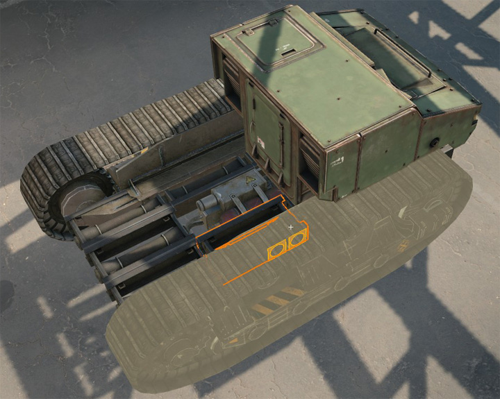
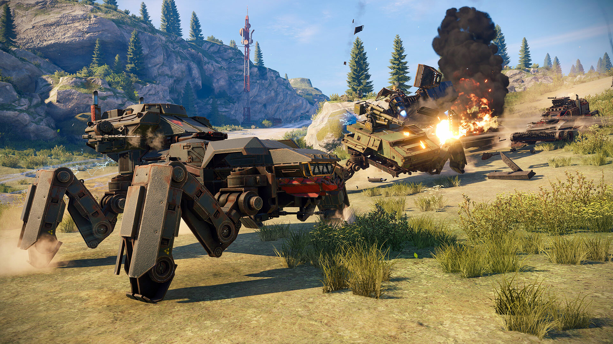
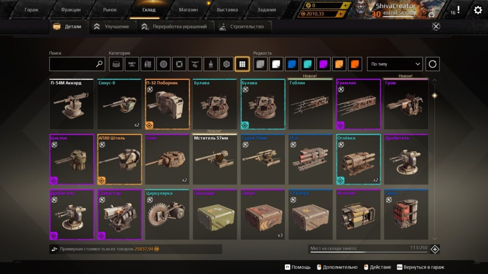

# MyProgect
 Индивидуальный проект по теме: онлайн игры.

 

    

# Crossout
Crossout — это многопользовательская онлайн-игра, в которой игроки создают уникальные боевые автомобили, сражаются друг с другом и исследуют постапокалиптический мир. Игра сочетает в себе элементы строительства, стратегии и динамичных сражений, позволяя пользователям разрабатывать свои транспортные средства, используя различные детали и вооружение. Цель проекта — создать увлекательный и разнообразный игровой опыт, где каждый игрок может проявить свою креативность и навыки в боях.

# Для успешного запуска и использования Crossout вам потребуется:
1. **Персональный компьютер** с операционной системой Windows, macOS или Linux.
2. **Интернет-соединение** для многопользовательской игры.
3. **Регистрация** на платформе игры (создание учетной записи).
4. **Модернизированный видеодрайвер**, поддерживающий современные графические игры.
5. **Минимальные системные требования:**
    - Процессор: AMD/Intel с тактовой частотой 2.4 ГГц
    - Оперативная память: 4 ГБ
    - Видеокарта: NVIDIA GeForce GTX 460 или аналогичная с 1 ГБ VRAM

# Как установить игру
Для установки Crossout выполните следующие шаги:

1. **Скачайте клиент игры:**
    - Перейдите на официальный сайт Crossout (https://crossout.net) и нажмите на кнопку «Скачать».

2. **Установите игру:**
    - Запустите скачанный установочный файл.
    - Следуйте инструкциям на экране, выбрав папку для установки.
    - Дождитесь завершения установки.

3. **Создайте учетную запись (если вы еще не сделали этого):**
    - Перейдите на страницу регистрации.
    - Заполните необходимые поля и подтвердите свою учетную запись через электронную почту.

4. **Запустите игру:**
    - После установки откройте Crossout через ярлык на рабочем столе или через клиент (например, Steam или Epic Games Store, если вы выбрали данные платформы для установки).

5. **Войдите в игру:**
    - Используйте свои учетные данные для входа и начните играть.

# Что делать в игре
После завершения установки и авторизации в игре вы можете начать:

1. **Создание автомобиля:**
    - Перейдите в раздел "Мастерская", где вы можете выбрать шасси, детали и оружие для своего автомобиля. Используйте разные комбинации частей, чтобы создать уникальную конструкцию.
     
 

 

 

2. **Сражения:**
    - Присоединяйтесь к различным режимам боя, таким как «Скоростные гонки», «Командный бой» или «Режимы PvE», где вы будете сражаться с другими игроками или против ботов.
     
 

 

3. **Улучшение и модернизация:**
    - Зарабатывайте опыт и ресурсы в боях, чтобы улучшать свой автомобиль и открывать новые детали.
    - Некоторые детали, такие как оружие, кабины, ходовые и.д. , можно покупать на внутреннем рынке.
     
 

 

 

 

4. **Пример использования:**
    - Например, для участия в «Командном бою», выберите соответствующий режим в меню и нажмите кнопку «Играть». Вы будете распределены по командам и сможете сразу начать сражение.
     
 

 

## Дополнительные полезные ссылки:

- https://crossout.net
- https://forum.crossout.net
- https://crossout.fandom.com/wiki/Crossout_Wiki

Исследуйте мир Crossout, улучшайте свои навыки и создавайте автомобили, способные справиться с любыми вызовами!